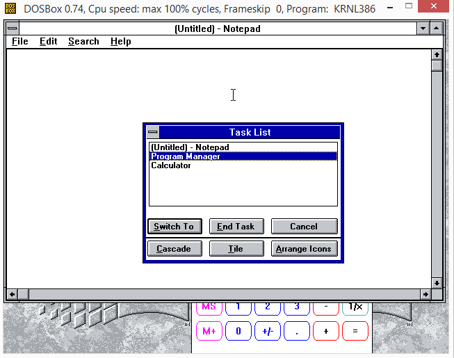

# osFree Task Manager (taskman)

A clone of the classic Windows 3.x Task Manager utility. This is part of the [osFree Win16 Personality](https://github.com/osfree-project/WIN16) project — an open-source implementation of the 16-bit Windows environment.

## 📖 About

This application is a functional clone of the Task Manager from Windows 3.x, heavily based on the book **"Undocumented Windows: A Programmer's Guide to Reserved Microsoft Windows API Functions"** by Andrew Schulman, David Maxey and Matt Pietrek. It displays a list of currently running applications and allows the user to manage them — switch between windows, end tasks, and arrange windows on the desktop.

It is a component of the **osFree Janus** project, which aims to create an open-source clone of Windows 3.0.

## ✨ Features

- **Running Tasks List**: Displays all currently running applications in a clear, scrollable list.
- **Task Switching**: Quickly switch to any running application by double-clicking its name in the list or by selecting it and pressing the **Switch To** button.
- **End Task**: Terminate a non-responsive or unwanted application by selecting it and pressing the **End Task** button.
- **Window Management**: Organize open windows on the desktop:
    - **Cascade**: Arranges windows in an overlapping pattern starting from the top-left corner.
    - **Tile**: Arranges windows side-by-side to fill the screen. Holding the **Shift** key while clicking the **Tile** button will tile windows horizontally.
- **Desktop Icon Arrangement**: Reorganizes desktop icons neatly with the **Arrange Icons** button.
- **Quick Access**: The Task Manager can be invoked at any time by pressing the **Ctrl+Esc** keyboard shortcut or by double-clicking on an empty area of the desktop.
- **Localization**: Supports English. Contributions for additional languages are welcome.

## 🧩 Project Structure

| File | Description |
| :--- | :--- |
| `taskman.c` | Main application source code |
| `taskman.h` | Header file with resource identifiers |
| `makefile` | Build file for Open Watcom Make |
| `taskman.rc` / `rsrc.rc` | Main resource file that includes language modules |
| `En.rc` | Resources for English |
| `_wcc.cmd` / `_wcc.sh` | Auxiliary build scripts |

## 🤝 Contributing

We welcome your contributions! Please keep the following in mind:

- **Bug reports**: Create issues in the [Issues](https://github.com/osfree-project/taskman/issues) section.
- **Pull requests**: Send your improvements and fixes.
- **Documentation and localization**: Help translating the interface into other languages is highly valuable.

## 📜 License

Distributed under the **osFree License** (BSD 3-Clause).  
See [LICENSE](LICENSE) for the full text.

*This license is essentially the standard BSD 3-Clause license, with the name "osFree" substituted in the non-endorsement clause. It permits free use, modification, and distribution, including for commercial purposes, provided the copyright notice is retained.*

## 🔗 Related Projects

- [osFree Win16 Personality (WIN16)](https://github.com/osfree-project/WIN16) — the main project to create an open-source clone of Windows 3.x
- [osFree Project](https://github.com/osfree-project) — the parent project for an open-source OS/2 clone
- [Winver](https://github.com/osfree-project/winver) — a clone of the Windows "About" dialog
- [Notepad](https://github.com/osfree-project/notepad) — a clone of Notepad

## 👤 Copyright

- Copyright (C) 2023 Yuri Prokushev and the [osFree](https://github.com/osfree-project) team

---

*Last updated: May 18, 2026*
